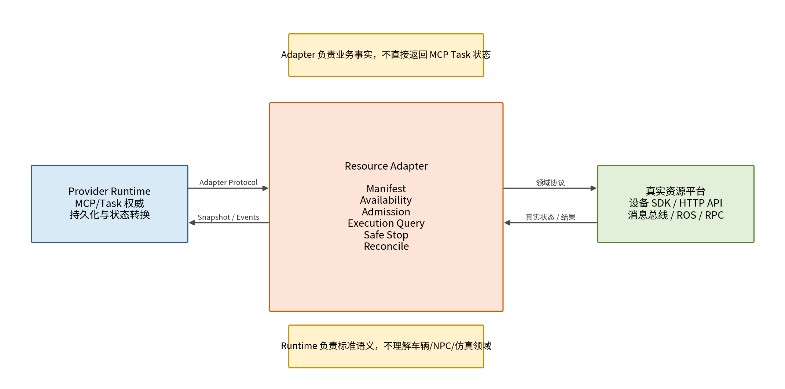
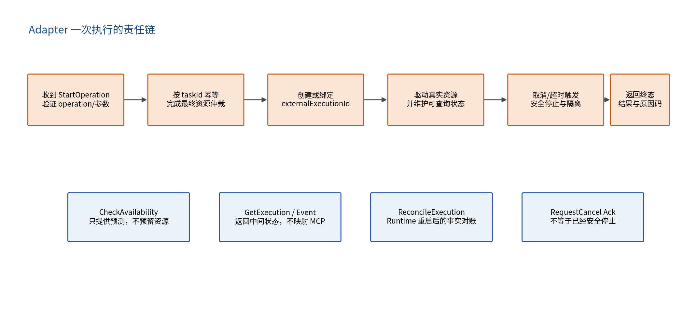

**SDAR MCP Tasks Resource Adapter**

设计说明书

**SDAR MCP Tasks Provider**

| 文档版本     | 1.0                                 |
|--------------|-------------------------------------|
| 文档状态     | V1.0 设计稿                         |
| 基线 Profile | SDAR MCP Tasks Provider Profile 1.0 |
| 日期         | 2026-07-16                          |

适用范围：跨语言资源 Provider 的标准化建设与接入

# 文档控制

| **版本** | **日期**   | **状态** | **说明**                                                        |
|----------|------------|----------|-----------------------------------------------------------------|
| 1.0      | 2026-07-16 | 设计稿   | 形成语言无关 Adapter Protocol、Manifest、状态、幂等与接入规范。 |

# 1. 文档定位

本文定义 Resource Adapter 的职责、协议与实现要求。Adapter 面向有限数量的单一资源类型，对接车辆、NPC、仿真、批处理或其他真实业务平台；它通过语言无关的 Adapter Protocol 向 Runtime 提供资源能力和执行事实。

| **核心边界：**Adapter 是资源业务事实和真实执行的权威，但不是 MCP Task 状态的权威。Adapter 不需要实现 SEP-2663、tools/list、tasks/get/update/cancel、Task 数据库或 Observation revision。 |
|------------------------------------------------------------------------------------------------------------------------------------------------------------------------------------------|

## 1.1 目标

- 让不同语言团队以统一协议提供资源 Provider 能力。

- 用 Manifest 声明有限数量的 Operation，并由 Runtime 动态生成 MCP Tool。

- 统一 Availability、最终准入、执行查询、取消、安全停止和重启对账接口。

- 明确 Adapter 中间状态，避免各团队直接解释 SEP-2663 状态。

- 保证 StartOperation、Cancel、Update 等副作用操作可幂等重试。

- 为 Java、Python、Go、C++、TypeScript SDK 和合规测试提供稳定契约。

## 1.2 非目标

- 不暴露 MCP Server，不处理 MCP 会话和 JSON-RPC 路由。

- 不保存完整 MCP Task 生命周期和标准状态。

- 不管理其他 Provider 的资源，不参与跨 Provider 仲裁。

- 不承担 Runtime 的 scheduled 持久定时和 maxElapsed 计时。

- 不允许通过 Manifest 向 Runtime 注入任意可执行代码。

# 2. 总体结构与责任边界

*图 1 Runtime、Adapter 与真实资源平台的责任分界*

| **能力**            | **Runtime**                       | **Adapter**                  |
|---------------------|-----------------------------------|------------------------------|
| MCP/SEP-2663        | 负责                              | 不负责                       |
| Operation/Tool 描述 | 生成与发布                        | 提供 Manifest                |
| Task 持久化与终态   | 负责                              | 不负责                       |
| Availability        | 组织协议和返回                    | 计算业务事实和建议窗口       |
| 最终准入            | 发起并处理结果                    | 最终决定接受/拒绝            |
| 真实执行            | 不直接控制                        | 负责调用资源平台             |
| 安全停止            | 协调、等待、映射终态              | 执行并确认底层不再产生副作用 |
| 重启恢复            | 扫描 Task、发起 Reconcile         | 查询真实执行事实             |
| 状态映射            | AdapterState → MCP status/outcome | 领域状态 → AdapterState      |

# 3. Adapter 部署模式

## 3.1 Sidecar 模式（推荐）

Runtime 与 Adapter 同一 Pod、Compose 服务组或主机部署。优点是网络边界简单、版本关系明确、故障域与 Provider 一致，适合绝大多数单域 Provider。

## 3.2 远程 Adapter 模式

Adapter 可作为已有资源平台的一部分远程部署。此时必须使用 mTLS、稳定服务发现、网络超时、幂等重试和事件流断线恢复。Runtime 与 Adapter 仍然是一对一或少量绑定关系，而不是公共任意插件市场。

## 3.3 进程内模式

V1.0 不建议把不同语言 Adapter 以插件形式加载到 Runtime 进程。进程内模式会引入 ABI、依赖冲突、崩溃隔离和动态代码安全问题，只可作为同语言测试实现。

# 4. Adapter Protocol

## 4.1 传输和版本

- 规范传输：Protobuf IDL + gRPC。

- 可选兼容：HTTP/JSON，字段和语义必须与 Protobuf 一致。

- 每次请求包含 adapterProtocolVersion、providerId、taskId/correlationId 和 executionModeContext。

- 破坏兼容性的字段或语义变化必须升级主版本；新增可选字段使用向后兼容方式。

## 4.2 方法清单

| **方法**              | **级别**        | **用途**                                     |
|-----------------------|-----------------|----------------------------------------------|
| DescribeProvider      | MUST            | 返回 Provider Manifest、Operation 和能力     |
| CheckAvailability     | MUST            | 根据当前资源事实返回预测状态、风险和时间窗口 |
| StartOperation        | MUST            | 完成最终准入并创建/绑定真实执行              |
| GetExecution          | MUST            | 幂等读取真实执行 Snapshot                    |
| RequestCancel         | MUST            | 接收安全停止请求并返回 Ack                   |
| ReconcileExecution    | MUST            | Runtime 重启或状态不确定时对账               |
| UpdateExecution       | CONDITIONAL     | 支持 input_required 时接收输入               |
| PauseExecution        | CONDITIONAL     | Operation 声明 pauseResume 时                |
| ResumeExecution       | CONDITIONAL     | Operation 声明 pauseResume 时                |
| StreamExecutionEvents | MAY             | 推送进度/状态，不能替代 GetExecution         |
| ListResources         | MAY/CONDITIONAL | Provider 需要暴露资源清单时                  |

*图 2 Adapter 从最终准入到安全终止的责任链*

# 5. Provider Manifest

## 5.1 顶层结构

{  
"adapterProtocolVersion": "1.0",  
"providerId": "vehicle-provider-a",  
"providerType": "vehicle",  
"providerVersion": "2.3.0",  
"inventoryMode": "runtime_visible",  
"operations": \[ ... \]  
}

## 5.2 OperationDefinition

{  
"name": "vehicle_patrol",  
"description": "控制指定车辆执行路线巡逻",  
"execution": "task_required",  
"inputSchema": { "type": "object", ... },  
"outputSchema": { "type": "object", ... },  
"capabilities": {  
"availability": true,  
"scheduling": true,  
"maxElapsed": true,  
"cancel": true,  
"pauseResume": false,  
"inputRequired": false,  
"idempotency": true,  
"observations": true  
},  
"resourceBinding": {  
"mode": "argument_reference",  
"resourceIdJsonPointer": "/resourceId"  
}  
}

## 5.3 Manifest 约束

- Operation name 在 Provider 内唯一，使用稳定小写命名，不包含资源实例 ID。

- Schema 必须是可静态校验的 JSON Schema，不得依赖任意脚本。

- execution、capabilities 与 Adapter 实际实现必须一致。

- supportsMaxElapsed=true 表示 Adapter 能安全停止并确认旧执行不再操作资源。

- 支持 scheduled 不代表 Adapter 自行计时；默认由 Runtime 在 scheduledAt 调用 StartOperation。

- ProviderVersion 或 Operation 版本变化必须保留兼容策略和变更记录。

# 6. 资源模型

## 6.1 ResourceInstance

message ResourceInstance {  
string resource_id = 1;  
string display_name = 2;  
string resource_type = 3;  
bool enabled = 4;  
ResourceHealth health = 5;  
map\<string, string\> labels = 6;  
google.protobuf.Struct metadata = 7;  
google.protobuf.Timestamp last_seen_at = 8;  
}

ResourceInstance 用于控制台、输入校验和 Availability 辅助，不用于为每个实例生成 MCP Tool。若底层资源不可枚举，可将 inventoryMode 设置为 opaque，并在每次调用中验证 resourceId。

## 6.2 资源占用权威

| **强制规则：**Adapter/真实资源平台是资源是否可用、是否被人工占用、是否可抢占以及是否已经释放的最终权威。Runtime 的可选串行控制只能减少显式冲突，不能替代最终准入。 |
|--------------------------------------------------------------------------------------------------------------------------------------------------------------------|

# 7. Availability 设计

## 7.1 请求输入

- requestId、operationName、arguments 或 unresolved arguments。

- timing：immediate/scheduled、scheduledAt、startToleranceMs、maxElapsedMs。

- authorization/execution mode 上下文，禁止从业务 arguments 中伪造。

## 7.2 返回状态

| **状态**   | **Adapter 含义**                                   | **必须字段**                                                     |
|------------|----------------------------------------------------|------------------------------------------------------------------|
| available  | 当前预计可以接受调用                               | validUntil；可选说明                                             |
| restricted | 允许尝试，但可能延迟、暂停其他任务、拒绝或部分完成 | reasonCode、riskLevel、validUntil、possibleEffects；建议时间窗口 |
| disabled   | 当前不得执行                                       | 稳定 reasonCode；建议恢复条件/下次检查时间                       |
| unknown    | 无法可靠预测                                       | 原因；禁止伪装为 available                                       |

CheckAvailability 不能占用、预留或启动资源。即使返回 available，StartOperation 仍必须重新检查并做最终准入。

## 7.3 时间窗口

- nextAvailableWindows 按 startTime 升序，使用带时区 RFC 3339 时间。

- 窗口是预测，不是预约。

- 无法预测窗口时 restricted + reasonCode=WINDOW_NOT_PREDICTABLE。

- validUntil 不得早于 checkedAt，过期后 Runtime 可重新查询。

# 8. StartOperation 与最终准入

## 8.1 请求模型

message StartOperationRequest {  
string task_id = 1;  
string operation_name = 2;  
google.protobuf.Struct arguments = 3;  
TaskTiming timing = 4;  
ExecutionContext execution_context = 5;  
string argument_hash = 6;  
uint32 invocation_attempt = 7;  
}

## 8.2 响应模型

message StartOperationResponse {  
oneof result {  
ExecutionAccepted accepted = 1;  
AdmissionRejected rejected = 2;  
}  
}  
  
message ExecutionAccepted {  
string external_execution_id = 1;  
ExecutionSnapshot initial_snapshot = 2;  
}  
  
message AdmissionRejected {  
string reason_code = 1;  
string message = 2;  
bool retryable = 3;  
repeated Alternative alternatives = 4;  
}

## 8.3 幂等要求

- taskId 是 StartOperation 的核心幂等键。相同 taskId 和相同参数必须返回同一 externalExecutionId 或同一拒绝结果。

- 相同 taskId 但 operationName、argumentHash 或 executionMode 不一致时必须返回冲突错误，不得创建新执行。

- RPC 超时并不表示调用未生效；Runtime 会使用相同 taskId 重试或 Reconcile。

- Adapter 必须在产生真实资源副作用之前持久化或可靠记录 taskId→externalExecutionId 绑定。

- 不允许先返回随机临时 ID，后续再替换 externalExecutionId。

# 9. 执行状态和 Snapshot

## 9.1 AdapterExecutionState

UNSPECIFIED  
ACCEPTED  
SCHEDULED  
QUEUED  
RUNNING  
PAUSED  
RESUMING  
WAITING_INPUT  
STOPPING  
SUCCEEDED  
BUSINESS_FAILED  
PARTIALLY_COMPLETED  
CANCELLED  
TECHNICAL_FAILED

## 9.2 状态语义

| **状态**            | **Adapter 必须保证的事实**                           |
|---------------------|------------------------------------------------------|
| ACCEPTED            | 执行已被稳定接受并可通过 externalExecutionId 查询    |
| SCHEDULED           | 仅用于 Adapter 原生预约；尚未开始真实执行            |
| QUEUED              | 已接受但在资源平台内部排队                           |
| RUNNING             | 正在产生真实执行活动                                 |
| PAUSED              | 执行状态可恢复，当前不继续推进；不代表 Task 终态     |
| WAITING_INPUT       | 需要明确输入请求才能继续                             |
| STOPPING            | 已收到停止要求，正在安全停止；仍可能存在资源活动     |
| SUCCEEDED           | 业务成功且不会继续产生副作用                         |
| BUSINESS_FAILED     | 可形成结构化业务失败，资源已稳定结束                 |
| PARTIALLY_COMPLETED | 部分结果可用，资源已稳定结束                         |
| CANCELLED           | 已确认安全停止和资源释放                             |
| TECHNICAL_FAILED    | 底层执行因技术协议错误无法形成正常业务结果，且已停止 |

## 9.3 ExecutionSnapshot

message ExecutionSnapshot {  
string task_id = 1;  
string external_execution_id = 2;  
AdapterExecutionState state = 3;  
uint64 revision = 4;  
string reason_code = 5;  
string message = 6;  
Progress progress = 7;  
repeated InputRequest input_requests = 8;  
google.protobuf.Struct result = 9;  
bool retryable = 10;  
repeated Alternative alternatives = 11;  
google.protobuf.Timestamp observed_at = 12;  
}

- revision 在单个 externalExecution 生命周期内单调递增。

- 重复查询可以返回相同 revision；新事实不能复用旧 revision。

- Snapshot 必须自包含，不能要求 Runtime 仅依赖丢失的增量事件还原状态。

- 终态 Snapshot 必须包含最终结果/原因码，且后续不可回到非终态。

# 10. GetExecution 与事件流

## 10.1 GetExecution

- 必须幂等、无副作用。

- 支持 taskId 和 externalExecutionId 的绑定校验。

- unknown execution 返回明确错误，不得默认构造成功状态。

- 业务平台暂时不可达时返回可区分的 TRANSIENT_UNAVAILABLE，Runtime 保留既有状态并重试。

## 10.2 StreamExecutionEvents

事件流是性能优化，不是正确性基础。事件包含 revision、type、occurredAt、reasonCode、progress 和可选 Snapshot。Runtime 断线后使用 GetExecution/Reconcile 补齐。

event revision 21: task.progress  
事件流断开  
实际资源继续运行  
Runtime 重连失败  
→ Runtime 调用 GetExecution  
→ 返回 Snapshot revision 27  
→ Runtime 直接推进到 revision 27，不要求补齐 22~26 的每个进度事件

# 11. 输入补充、暂停和恢复

## 11.1 UpdateExecution

- 只在 Operation 声明 inputRequired=true 时实现。

- InputRequest key 在一次执行内唯一，已回答 key 不得复用。

- 重复回答必须幂等；未知 key 不产生副作用。

- Update Ack 不表示已经恢复运行，状态变化通过 Snapshot/Event 返回。

## 11.2 Pause/Resume

- Pause Ack 仅表示请求被接受；PAUSED Snapshot 表示真实暂停完成。

- Resume Ack 仅表示请求被接受；RESUMING/RUNNING 表示恢复进展。

- Adapter 必须明确哪些 Operation 不可暂停，并在 Manifest 中关闭能力。

- 暂停期间如资源仍可能产生副作用，不得报告 PAUSED。

# 12. 取消和安全停止

## 12.1 RequestCancel 语义

RequestCancel(taskId, reason)  
返回 Ack：已记录停止请求  
后续 Snapshot：STOPPING  
底层确认停止、隔离旧执行、释放资源  
后续 Snapshot：CANCELLED / SUCCEEDED / BUSINESS_FAILED

Adapter 可以在取消请求到达前任务已经自然完成，此时最终状态可以是 SUCCEEDED 或 BUSINESS_FAILED。禁止为了迎合取消请求将已经成功的任务伪造成 CANCELLED。

## 12.2 deadline 安全要求

- 收到 reason=DEADLINE_REACHED 后阻止新的资源副作用。

- 停止、撤销或隔离底层执行，并确认旧执行不会继续操作资源。

- 释放资源后才返回稳定终态。

- 如果无法做到上述保证，Operation 必须声明 supportsMaxElapsed=false。

# 13. ReconcileExecution

Reconcile 是 Adapter 设计中的关键方法，用于 Runtime 重启、StartOperation 超时、事件丢失和状态不一致。它返回真实资源平台当前可证实的事实，而不是根据 Runtime 期望推断状态。

| **输入场景**                     | **Adapter 返回**                         |
|----------------------------------|------------------------------------------|
| taskId 已绑定有效执行            | 当前完整 Snapshot 和 externalExecutionId |
| StartOperation 已成功但响应丢失  | 相同 externalExecutionId 和当前 Snapshot |
| taskId 从未创建执行              | NOT_FOUND + 可重试/不可重试说明          |
| 执行已被底层平台清理但有终态记录 | 持久终态 Snapshot                        |
| 资源平台暂时不可达               | TRANSIENT_UNAVAILABLE，不伪造终态        |
| taskId 与执行模式/参数不一致     | CONFLICT，禁止访问或重建                 |

- Adapter 对非终态执行必须保存足够的映射信息，以支持 Provider 重启后的查询。

- 终态记录的保留时间应不短于 Runtime 的 Task Handle 保留要求。

- 若底层系统无法恢复执行，Adapter 应返回 TECHNICAL_FAILED 的明确证据，而不是业务成功。

# 14. 错误模型

| **错误类型**               | **使用场景**                             | **示例**                              |
|----------------------------|------------------------------------------|---------------------------------------|
| ProtocolError              | 请求字段、版本、未知 Operation、鉴权错误 | INVALID_ARGUMENT、UNSUPPORTED_VERSION |
| AdmissionRejected          | 资源业务拒绝且未创建执行                 | RESOURCE_BUSY、RESOURCE_DISABLED      |
| Business failure Snapshot  | 执行已接受后出现业务失败                 | TARGET_UNREACHABLE、SCENARIO_INVALID  |
| Technical failure Snapshot | 执行中技术故障，无法形成正常业务结果     | DOWNSTREAM_PROTOCOL_ERROR             |
| Transient unavailable      | 查询/对账暂不可用，不改变已知 Task 事实  | RESOURCE_PLATFORM_TIMEOUT             |
| Conflict                   | 同 taskId 参数或 execution mode 不一致   | IDEMPOTENCY_CONFLICT                  |

## 14.1 reasonCode 规范

- 使用稳定大写下划线标识，例如 RESOURCE_BUSY、RESOURCE_OFFLINE。

- 同一含义不得因语言团队不同产生多个近义码。

- message 用于展示，可变化；自动决策必须依赖 reasonCode、retryable 和 alternatives。

- 禁止在 reasonCode/message 中泄露其他租户任务、凭据或内部地址。

# 15. 幂等和一致性实现

| **方法**        | **幂等键**                      | **要求**                                       |
|-----------------|---------------------------------|------------------------------------------------|
| StartOperation  | taskId                          | 相同输入返回原 accepted/rejected；不同输入冲突 |
| RequestCancel   | taskId + cancel reason category | 重复请求不重复执行危险停止动作                 |
| UpdateExecution | taskId + inputRequestKey        | 重复回答不重复业务副作用                       |
| Pause/Resume    | taskId + command sequence       | 重复命令返回当前事实                           |
| Get/Reconcile   | taskId/externalExecutionId      | 无副作用读取                                   |

Adapter 应在真实资源副作用之前写入本地数据库、资源平台幂等接口或等效的 durable mapping。仅使用内存 Map 不满足重启恢复要求。

# 16. 安全与隔离

- 验证 Runtime 身份，默认 mTLS；不接受任意网络客户端直接控制资源。

- executionMode（live/simulation/historical-replay）必须作为受信任上下文处理，并参与 taskId 绑定。

- Simulation/Replay Adapter 不得路由到真实资源；同一 taskId 不允许跨 mode 操作。

- arguments 需进行领域校验、范围校验和资源权限校验，不能只依赖 JSON Schema。

- 调用命令、URL、文件路径和脚本参数必须防止命令注入、SSRF 和路径穿越。

- 状态、日志和错误消息脱敏；不得把 Runtime 认证 Header 透传给外部调用方。

# 17. 多语言 SDK 设计

各语言 SDK 应保持“薄封装”，只提供生成的 gRPC 类型、服务器启动、上下文解析、标准错误/状态辅助和测试夹具。任务状态机、持久调度、MCP 映射不得复制到语言 SDK。

| **SDK**    | **建议交付**                                                           |
|------------|------------------------------------------------------------------------|
| Java       | Gradle/Maven 包、gRPC server bootstrap、CompletableFuture/虚拟线程示例 |
| Python     | PyPI 包、asyncio gRPC、Pydantic/JSON Schema 辅助、pytest fixture       |
| Go         | Go module、生成 protobuf、context/cancellation helper、test harness    |
| C++        | 生成 protobuf、CMake 示例、线程安全状态仓库接口                        |
| TypeScript | npm 包、grpc-js server、Zod/JSON Schema 转换辅助                       |

## 17.1 语言 SDK 统一接口

interface AdapterImplementation {  
describeProvider(): ProviderManifest;  
checkAvailability(req): AvailabilityResponse;  
startOperation(req): StartOperationResponse;  
getExecution(req): ExecutionSnapshot;  
requestCancel(req): CancelAck;  
reconcileExecution(req): ExecutionSnapshot;  
  
// optional  
updateExecution?(req): UpdateAck;  
pauseExecution?(req): CommandAck;  
resumeExecution?(req): CommandAck;  
streamExecutionEvents?(req): EventStream;  
}

# 18. Adapter 实现模板

class VehicleAdapter:  
def start_operation(self, req):  
self.validate_operation(req.operation_name, req.arguments)  
  
existing = self.execution_store.find_by_task_id(req.task_id)  
if existing:  
self.assert_same_request(existing, req)  
return existing.original_start_response  
  
availability = self.vehicle_platform.check_realtime(req.arguments\["resourceId"\])  
if not availability.can_start:  
rejected = AdmissionRejected(...)  
self.execution_store.save_rejection(req.task_id, req, rejected)  
return rejected  
  
\# 先建立幂等绑定，再产生资源副作用  
record = self.execution_store.reserve(req.task_id, req)  
external_id = self.vehicle_platform.start_patrol(..., idempotency_key=req.task_id)  
record.bind_external_execution(external_id)  
return ExecutionAccepted(external_id, initial_snapshot=...)

| **禁止实现：**不要在 StartOperation 中“先调用真实资源，成功后才在内存里记录 taskId”。Runtime 重试或 Adapter 重启会造成重复任务。 |
|----------------------------------------------------------------------------------------------------------------------------------|

# 19. Adapter 合规测试

| **测试组**     | **必须覆盖**                                                 |
|----------------|--------------------------------------------------------------|
| Manifest       | 版本、Schema、Operation 唯一、能力与方法一致                 |
| Availability   | 四状态、validUntil、窗口排序、unknown 不伪装 available       |
| StartOperation | 接受、拒绝、相同 taskId 重试、参数冲突、响应丢失后 Reconcile |
| Execution      | 状态单调、revision、终态不可逆、Snapshot 自包含              |
| Cancel         | Ack 与终态分离、重复取消、安全停止、自然完成竞态             |
| Input/Pause    | 重复输入、未知 key、Pause/Resume Ack 与事实分离              |
| Recovery       | Adapter 重启、资源平台短暂故障、执行映射恢复、终态保留       |
| Security       | Runtime 身份、跨 mode 拒绝、参数注入、日志脱敏               |

## 19.1 最小 Mock 场景

- 一个 available 资源，执行 5 秒后成功。

- 一个 restricted 资源，返回未来可用窗口。

- 一个 disabled 资源，StartOperation 同步拒绝。

- 一个任务进入 WAITING_INPUT，收到输入后继续。

- 一个任务取消后经历 STOPPING，再进入 CANCELLED。

- 一个任务在 StartOperation 响应丢失后可通过 Reconcile 找回。

- 一个任务在 Adapter 重启后保持 externalExecutionId 和终态。

# 20. Adapter 交付清单

> **1.** Adapter 服务镜像或可执行包。
>
> **2.** Provider Manifest 和 JSON Schema。
>
> **3.** 资源平台依赖、认证与网络说明。
>
> **4.** Operation 输入/输出示例及 reasonCode 清单。
>
> **5.** Availability 和可用时间窗口计算规则。
>
> **6.** StartOperation 幂等策略与映射存储说明。
>
> **7.** 取消、deadline、安全停止和资源释放说明。
>
> **8.** Reconcile 和 Adapter 重启恢复说明。
>
> **9.** Simulation/Replay 隔离说明。
>
> **10.** Adapter 合规测试报告与 Mock 配置。

# 21. 验收标准

- 资源团队无需实现 MCP/SEP-2663 即可被 Runtime 暴露为标准 Provider。

- 相同 taskId 的重复 StartOperation 不产生第二个真实执行。

- Availability 与 StartOperation 分离，最终准入基于实时事实。

- 取消 Ack、STOPPING 和稳定终态语义清楚，不提前报告资源已停止。

- Adapter 重启或 StartOperation 响应丢失后可通过 Reconcile 恢复真实执行。

- 业务状态只映射到统一 AdapterExecutionState，不直接返回 MCP status。

- 通过 Runtime 提供的 Adapter Testkit。

# 附录 A：Protobuf IDL 轮廓

syntax = "proto3";  
package io.sdar.mcp.tasks.adapter.v1;  
  
service ResourceProviderAdapter {  
rpc DescribeProvider(DescribeProviderRequest) returns (ProviderManifest);  
rpc CheckAvailability(CheckAvailabilityRequest) returns (CheckAvailabilityResponse);  
rpc StartOperation(StartOperationRequest) returns (StartOperationResponse);  
rpc GetExecution(GetExecutionRequest) returns (ExecutionSnapshot);  
rpc RequestCancel(RequestCancelRequest) returns (CommandAck);  
rpc ReconcileExecution(ReconcileExecutionRequest) returns (ExecutionSnapshot);  
// Optional: ListResources, Update, Pause, Resume, StreamEvents  
}  
  
enum AdapterExecutionState {  
ADAPTER_EXECUTION_STATE_UNSPECIFIED = 0;  
ACCEPTED = 1; SCHEDULED = 2; QUEUED = 3; RUNNING = 4;  
PAUSED = 5; RESUMING = 6; WAITING_INPUT = 7; STOPPING = 8;  
SUCCEEDED = 20; BUSINESS_FAILED = 21; PARTIALLY_COMPLETED = 22;  
CANCELLED = 23; TECHNICAL_FAILED = 24;  
}

# 参考基线

《SDAR MCP Tasks Provider Profile》，Profile 版本 1.0，日期 2026-07-16。本文档不重新定义 SEP-2663，而是给出 Provider Runtime/Adapter 的工程实现设计。
