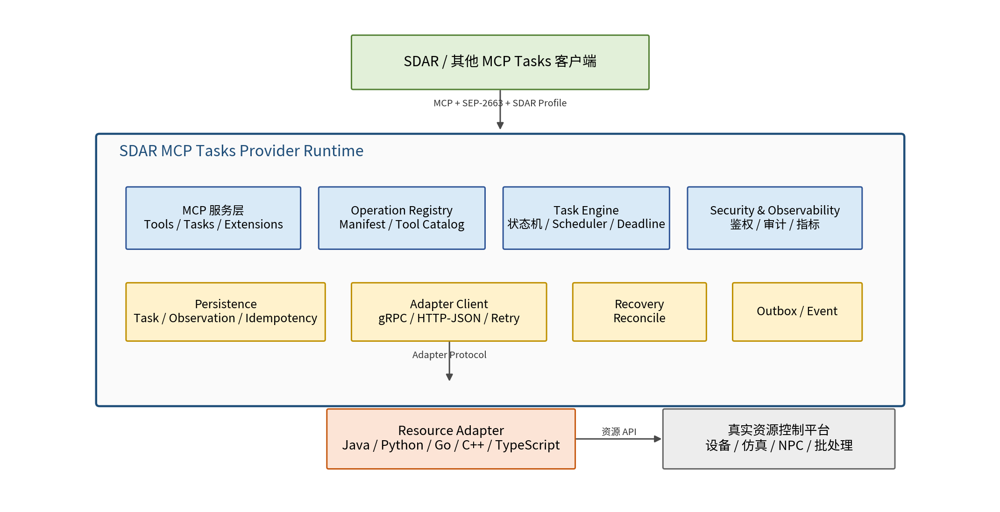
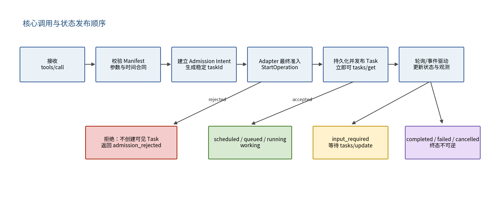

**SDAR MCP Tasks Provider Runtime**

设计说明书

**SDAR MCP Tasks Provider**

| 文档版本     | 1.0                                 |
|--------------|-------------------------------------|
| 文档状态     | V1.0 设计稿                         |
| 基线 Profile | SDAR MCP Tasks Provider Profile 1.0 |
| 日期         | 2026-07-16                          |

适用范围：跨语言资源 Provider 的标准化建设与接入

# 文档控制

| **版本** | **日期**   | **状态** | **说明**                                                    |
|----------|------------|----------|-------------------------------------------------------------|
| 1.0      | 2026-07-16 | 设计稿   | 形成语言无关 Runtime 的模块、协议、状态机、存储和交付边界。 |

# 1. 文档定位

本文定义一个独立部署、语言无关的 SDAR MCP Tasks Provider Runtime。Runtime 与业务资源 Adapter 共同构成完整 Provider：Runtime 负责 MCP、SEP-2663 与 SDAR Profile 的标准语义；Adapter 负责有限数量、单一资源类型的业务事实与真实控制。

| **核心定位：**Runtime 不是跨 Provider 的全局资源调度中心，也不是任意资源的统一控制平台。每个 Provider 部署单元拥有自己的 Runtime、Adapter、任务数据与资源边界。 |
|-----------------------------------------------------------------------------------------------------------------------------------------------------------------|

## 1.1 建设目标

- 让 Java、Python、Go、C++、TypeScript 等团队只实现资源 Adapter，而不重复实现 MCP Tasks。

- 统一实现 tools/list、tools/call、tasks/get、tasks/update、tasks/cancel 及 SDAR 扩展方法。

- 统一实现 Task 持久化、状态机、scheduled、startTolerance、maxElapsed、幂等和重启恢复。

- 根据 Adapter Manifest 动态生成有限数量的 MCP Tool，不按资源实例生成 Tool。

- 将 Adapter 的业务中间状态稳定映射为 SEP-2663 标准状态和结构化业务终态。

- 通过合规测试套件确保不同资源 Provider 对外行为一致。

## 1.2 非目标

- 不管理不同 Provider 之间的资源互斥、竞价或全局公平调度。

- 不定义车辆、NPC、仿真、批处理等领域的资源本体。

- 不替代底层资源平台原有的安全控制、设备锁和故障处置。

- 不要求所有 Provider 使用同一数据库实例或集中式任务服务。

- V1.0 不支持运行时加载任意业务代码；动态 Tool 来自声明式 Manifest。

# 2. 总体架构

*图 1 Runtime 与 Adapter 的部署和职责关系*

## 2.1 部署单元

每个资源 Provider 建议作为一个独立部署单元：Runtime 使用统一镜像，Adapter 使用业务团队镜像，两者通过本地网络、容器网络或 Unix Domain Socket 通信。Provider 只管理本领域内的资源实例。

Provider Deployment Unit  
├─ sdar-mcp-tasks-runtime:1.0  
├─ resource-adapter:\<team-version\>  
├─ PostgreSQL（推荐，亦可使用兼容实现）  
└─ Runtime/Adapter 双向认证配置

## 2.2 组件职责

| **组件**               | **职责**                                             | **禁止承担的职责**                 |
|------------------------|------------------------------------------------------|------------------------------------|
| MCP Server             | 协议协商、Tool/Task 方法、扩展方法、路由和响应       | 不调用领域 SDK，不解释资源业务状态 |
| Operation Registry     | 加载和校验 Manifest，生成 Tool Catalog，保存版本快照 | 不动态执行 Adapter 提供的代码      |
| Task Engine            | 内部状态机、调度、deadline、取消协调、输入等待       | 不自行判定资源真实可用性           |
| Persistence            | Task、Observation、输入请求、幂等、准入意图和 Outbox | 不保存其他 Provider 的全局资源状态 |
| Adapter Client         | RPC、重试、熔断、事件订阅、Reconcile                 | 不将 RPC Ack 直接等同于 MCP 终态   |
| Security/Observability | 鉴权、租户/模式隔离、审计、日志、指标和追踪          | 不在业务结果中泄露内部凭据         |

# 3. 对外协议设计

## 3.1 MCP 与 Profile 能力

Runtime 必须声明 SEP-2663 Tasks 能力，并根据配置声明 io.sdar/taskExecution Profile 能力。支持项必须与 Adapter Manifest 和 Runtime 实际能力共同求交集，禁止声明后无法履约。

capability = runtimeCapability ∩ adapterOperationCapability  
  
示例：  
Runtime 支持 scheduling=true，Adapter operation 支持 scheduling=false  
=\> 对该 Tool 发布 supportsScheduling=false

## 3.2 必须实现的方法

| **方法**          | **用途**                           | **关键约束**                                                       |
|-------------------|------------------------------------|--------------------------------------------------------------------|
| tools/list        | 返回基于 Manifest 生成的 Tool 清单 | Tool 数量由 Operation 数量决定，不由资源实例数量决定               |
| tools/call        | 执行同步 Operation 或创建 Task     | immediate 可在准入拒绝时不创建 Task；scheduled 接受后必须创建 Task |
| tasks/get         | 幂等返回 DetailedTask              | 读取不得触发资源副作用                                             |
| tasks/update      | 提交 input_required 所需输入       | 仅 Ack；真实状态通过后续 get/通知返回                              |
| tasks/cancel      | 记录取消请求                       | Ack 不等于资源已停止；终态需等待安全停止                           |
| checkAvailability | 批量查询 Operation 可用性          | 结果是预测，不是预留或执行授权                                     |

# 4. Operation Registry 与动态 Tool

## 4.1 Manifest 加载

> **1.** Runtime 启动后调用 Adapter.DescribeProvider。
>
> **2.** 校验 adapterProtocolVersion、Provider 标识、Operation 名称唯一性和 JSON Schema。
>
> **3.** 校验 Operation 声明的可选能力与 Adapter 方法支持情况一致。
>
> **4.** 形成不可变 Operation Snapshot，并根据 Snapshot 生成 MCP Tool。
>
> **5.** Provider Task 创建时保存所用 Operation Snapshot 版本，避免 Manifest 升级改变历史 Task 语义。

| **V1.0 决策：**首版采用“启动时加载、变更后重启”的稳定策略。热更新仅作为后续能力，避免在执行中的任务上引入 Schema 和语义漂移。 |
|-------------------------------------------------------------------------------------------------------------------------------|

## 4.2 Tool 生成规则

- Tool name 直接采用 operation.name，并在单个 Provider 内唯一。

- inputSchema/outputSchema 来自 Manifest，经 Runtime 再校验和规范化。

- io.sdar/taskExecution Tool Profile 元数据由 Runtime生成。

- 资源 ID 应作为 arguments 字段传入，不为每个资源实例生成不同 Tool。

- Runtime 禁止执行 Manifest 内的脚本、表达式或动态模块。

vehicle_patrol({  
"resourceId": "vehicle-001",  
"routeId": "route-008"  
})  
  
而不是：vehicle_001_patrol / vehicle_002_patrol / ...

# 5. Task 状态模型

## 5.1 外部标准状态

| **SEP-2663 status** | **Runtime 使用场景**                                          | **终态** |
|---------------------|---------------------------------------------------------------|----------|
| working             | scheduled、queued、running、paused、resuming、stopping        | 否       |
| input_required      | Adapter 明确等待客户端补充输入                                | 否       |
| completed           | 成功或可结构化表达的业务失败                                  | 是       |
| failed              | Task 执行中的 JSON-RPC/技术协议错误，无法形成正常 Tool Result | 是       |
| cancelled           | 底层执行已经安全停止并释放资源                                | 是       |

## 5.2 Runtime 内部状态

ADMISSION_PENDING // 内部准入意图，尚未对客户端暴露  
SCHEDULED // 已创建，等待 scheduledAt  
STARTING // 正在调用 Adapter.StartOperation  
QUEUED  
RUNNING  
PAUSED  
RESUMING  
INPUT_REQUIRED  
STOPPING  
TERMINAL_COMPLETED  
TERMINAL_FAILED  
TERMINAL_CANCELLED

## 5.3 Adapter 状态映射

| **AdapterExecutionState**     | **Runtime substate** | **MCP status / outcome**                      |
|-------------------------------|----------------------|-----------------------------------------------|
| ACCEPTED / SCHEDULED / QUEUED | scheduled / queued   | working                                       |
| RUNNING                       | running              | working                                       |
| PAUSED / RESUMING             | paused / resuming    | working                                       |
| WAITING_INPUT                 | input_required       | input_required                                |
| STOPPING                      | stopping             | working 或 input_required（保持原标准状态）   |
| SUCCEEDED                     | —                    | completed + isError=false + success           |
| BUSINESS_FAILED               | —                    | completed + isError=true + business_failure   |
| PARTIALLY_COMPLETED           | —                    | completed + isError=true + partial_completion |
| CANCELLED                     | —                    | cancelled                                     |
| TECHNICAL_FAILED              | —                    | failed，仅限无法构造正常业务结果的技术错误    |

| **终态规则：**终态发布前必须确认底层执行不再产生资源副作用、相关资源已释放、最终结果已持久化。所有对外终态不可逆。 |
|--------------------------------------------------------------------------------------------------------------------|

# 6. 关键流程

*图 2 immediate 调用、准入和 Task 状态发布流程*

## 6.1 immediate task_required 调用

> **1.** 校验 Tool、arguments、授权上下文、execution mode 和 timing。
>
> **2.** 创建不可见 Admission Intent，生成稳定 taskId，并记录 idempotencyKey/参数哈希。
>
> **3.** 以 taskId 作为 Adapter 幂等键调用 StartOperation，Adapter 完成最终资源仲裁。
>
> **4.** 若 Adapter 拒绝：不创建可见 Task，返回 CallToolResult.isError=true，outcome=admission_rejected。
>
> **5.** 若 Adapter 接受：在事务中创建 provider_task、初始 Observation 和 Operation Snapshot 引用，提交后返回 CreateTaskResult。
>
> **6.** 返回 taskId 前必须保证 tasks/get 立即可查。

## 6.2 scheduled 调用

> **1.** 调用阶段只校验能力、参数和时间合同；接受后立即创建持久 Task，status=working、substate=scheduled。
>
> **2.** Runtime 在 scheduledAt 前不调用真实执行；在时间到达后进入 STARTING 并调用 Adapter.StartOperation。
>
> **3.** Adapter 在实际启动点完成最终仲裁；到 latestStartAt 仍未接受或无法开始，则安全终止为 completed + start_window_missed。
>
> **4.** scheduledAt 前等待不计入 maxElapsed；scheduledAt 后 queued、running、paused、input_required 均计入。

## 6.3 input_required 与 tasks/update

> **1.** Adapter Snapshot 返回 WAITING_INPUT 与稳定 inputRequests。
>
> **2.** Runtime 保存输入请求键和 revision，映射为 status=input_required。
>
> **3.** tasks/update 校验 taskId、授权和输入 Key，调用 Adapter.UpdateExecution。
>
> **4.** Adapter Ack 只表示输入已接收；Runtime 通过后续 Snapshot/Event 决定状态是否改变。
>
> **5.** 重复输入必须幂等；未知 Key 不得触发资源副作用。

## 6.4 取消与 deadline

tasks/cancel 或 deadline 到达  
→ 持久化 cancel_requested / stop_reason  
→ 调用 Adapter.RequestCancel  
→ Task 保持 working/input_required，substate=stopping  
→ 轮询或事件确认底层安全停止  
→ 资源释放与最终结果持久化  
→ 用户取消：status=cancelled  
→ deadline：status=completed, isError=true, outcome=deadline_reached

Adapter 仅返回取消请求 Ack 时，Runtime 禁止立即发布 cancelled。若 Operation 无法保证安全停止，Manifest 必须声明 supportsMaxElapsed=false，并拒绝非空 maxElapsed。

# 7. Adapter Protocol 客户端设计

## 7.1 方法依赖

| **Adapter 方法**                 | **Runtime 调用时机**               | **是否必需**           |
|----------------------------------|------------------------------------|------------------------|
| DescribeProvider                 | 启动/健康恢复时                    | 必须                   |
| CheckAvailability                | SDAR availability 请求             | 必须                   |
| StartOperation                   | immediate 准入或 scheduledAt 到达  | 必须                   |
| GetExecution                     | 轮询真实状态                       | 必须                   |
| RequestCancel                    | 用户取消、deadline、安全停止       | 必须                   |
| ReconcileExecution               | Runtime 重启、状态不确定、事件丢失 | 必须                   |
| UpdateExecution                  | input_required 输入                | 按能力                 |
| PauseExecution / ResumeExecution | 受限仲裁或业务控制                 | 按能力                 |
| StreamExecutionEvents            | 降低轮询延迟                       | 可选，轮询始终为兜底   |
| ListResources                    | 控制台/资源校验                    | 可选或按 inventoryMode |

## 7.2 RPC 可靠性规则

- 所有产生资源副作用的方法必须携带 taskId、operationName、authorizationContextHash 和 invocationAttempt。

- StartOperation 必须按 taskId 幂等；Runtime 超时重试不得创建第二个外部执行。

- GetExecution、ReconcileExecution 必须为无副作用幂等读取。

- RequestCancel、Pause、Resume、Update 必须幂等或可安全去重。

- Runtime 对读调用可以指数退避重试；对写调用只在具备稳定幂等键时重试。

- 事件流中断不得影响 Task 正确性，Runtime 回退到轮询和 Reconcile。

## 7.3 超时建议

| **调用**           | **默认超时**  | **重试建议**                                     |
|--------------------|---------------|--------------------------------------------------|
| DescribeProvider   | 5s            | 启动时 3 次，失败则 Provider 不就绪              |
| CheckAvailability  | 3s            | 最多 1 次快速重试，仍失败返回 unknown            |
| StartOperation     | 10s（可配置） | 仅按 taskId 幂等重试；状态不确定时进入 Reconcile |
| GetExecution       | 3s            | 指数退避，结合 pollInterval                      |
| RequestCancel      | 5s            | 幂等重试；不因 RPC 超时直接发布终态              |
| ReconcileExecution | 10s           | 受控重试，超过阈值进入人工/故障策略              |

# 8. 持久化设计

## 8.1 推荐数据库

V1.0 推荐 PostgreSQL。Runtime 必须通过 Repository 接口隔离存储实现，但首个生产实现以 PostgreSQL 事务、唯一约束、行锁和 Outbox 为可靠性基线。

## 8.2 核心表

| **表**             | **主要字段**                                                                                                             | **用途**                                       |
|--------------------|--------------------------------------------------------------------------------------------------------------------------|------------------------------------------------|
| provider_task      | task_id、operation_name、resource_ref、status、substate、arguments、result、timing、external_execution_id、mode、version | Task 权威记录                                  |
| admission_intent   | task_id、idempotency_key、argument_hash、state、adapter_response                                                         | 解决 StartOperation 与 Task 发布之间的崩溃窗口 |
| task_observation   | task_id、revision、type、reason_code、occurred_at、payload                                                               | 单调 revision 的观测事件                       |
| task_input_request | task_id、request_key、schema、status、answer_hash                                                                        | input_required 稳定性与幂等                    |
| idempotency_record | authorization_hash、operation_name、key、argument_hash、task_id/result                                                   | 重复 tools/call 去重                           |
| operation_snapshot | provider_version、operation_name、manifest_hash、definition                                                              | 保留历史 Task 的协议语义                       |
| outbox_event       | event_id、aggregate_id、event_type、payload、published_at                                                                | 通知、事件投递与事务一致性                     |

## 8.3 创建顺序与事务边界

immediate：  
1. INSERT admission_intent（稳定 taskId、幂等信息）  
2. Adapter.StartOperation(taskId)  
3. accepted：事务创建 provider_task + observation + outbox  
4. COMMIT  
5. 返回 CreateTaskResult  
  
scheduled：  
1. 事务创建 provider_task(substate=scheduled) + idempotency + outbox  
2. COMMIT  
3. 返回 CreateTaskResult  
4. scheduledAt 到达后调用 Adapter.StartOperation

# 9. 调度、并发与资源边界

## 9.1 Runtime-managed scheduling

默认由 Runtime 管理 scheduledAt、latestStartAt、deadlineAt 和持久定时器，减少各语言 Adapter 重复实现。Adapter 只在 StartOperation 时接收 timing 上下文，并完成真实准入。

## 9.2 同一 Provider 内的并发

Adapter 是资源占用的最终权威。Runtime 可以根据 Manifest 提供可选的 exclusive_by_resource_key 串行化，用于降低明显冲突，但不能替代资源平台自身的设备锁、人工占用判断或 fencing。

operation.concurrency = {  
mode: "exclusive_by_resource_key",  
resourceKeyJsonPointers: \["/resourceId"\]  
}  
  
注意：该能力仅在单 Provider 内生效。

# 10. 重启恢复与对账

| **Task 情况**                                         | **Runtime 重启后的处理**                                                   |
|-------------------------------------------------------|----------------------------------------------------------------------------|
| SCHEDULED 且未到 scheduledAt                          | 重新注册持久定时器，不调用 Adapter                                         |
| STARTING / admission 状态不确定                       | 使用同一 taskId 调用 Reconcile；必要时幂等重试 StartOperation              |
| QUEUED / RUNNING / PAUSED / INPUT_REQUIRED / STOPPING | 调用 ReconcileExecution，更新 Snapshot 和 Observation                      |
| Adapter 报告执行不存在                                | 结合 admission intent 和历史证据决定重试或 technical failure，禁止伪造成功 |
| 已终态 Task                                           | 只恢复查询与 TTL，不再调用资源执行接口                                     |

- Provider 就绪条件：数据库迁移完成、Manifest 校验成功、Adapter 可达、恢复扫描已启动。

- 恢复过程中 tasks/get 仍可返回持久状态，但应通过 statusMessage 明确“正在对账”。

- 同一 Task 的 Reconcile 必须串行，防止多实例并发恢复。

# 11. 安全设计

- 客户端到 Runtime：支持 OAuth2/JWT、mTLS 或部署环境提供的身份认证。

- Runtime 到 Adapter：优先使用 mTLS；同 Pod/主机可使用 Unix Domain Socket 加文件权限。

- taskId 必须与调用者授权上下文和 execution mode 绑定，禁止跨租户/跨 simulation-live 操作。

- Manifest 与 JSON Schema 必须限制大小、深度、正则复杂度和未知字段，防止资源耗尽。

- arguments、statusMessage、Adapter 错误和日志必须脱敏；禁止将认证 Header 透传进业务输出。

- 对 Adapter 地址、回调、外部 URL 和命令字段执行 SSRF、注入和路径穿越防护。

- Runtime 不加载 Adapter 提供的任意代码。

# 12. 可观测性与运维

| **类别** | **建议指标/日志**                                                           |
|----------|-----------------------------------------------------------------------------|
| 协议     | tools/call 成功率、Task 创建延迟、get/update/cancel 错误率、JSON-RPC 错误码 |
| Task     | 各状态数量、启动等待、执行时长、deadline/start-window 命中、取消耗时        |
| Adapter  | RPC 延迟、超时、重试、Reconcile 次数、事件流重连、状态不一致                |
| 可靠性   | 重复调用去重、恢复 Task 数、Outbox 堆积、Observation revision 冲突          |
| 资源业务 | reasonCode、availability 分布、restricted 风险和建议时间窗口                |

所有日志和 Trace 必须包含 providerId、taskId、operationName、resourceRef、executionMode 和 correlationId；不得仅依赖 externalExecutionId 作为跨系统关联键。

# 13. 配置模型

runtime:  
providerId: vehicle-provider-a  
databaseUrl: postgresql://...  
adapter:  
protocol: grpc  
endpoint: dns:///vehicle-adapter:7001  
tls: required  
task:  
terminalRetention: 72h  
recoveryScanInterval: 15s  
defaultPollInterval: 2s  
profile:  
availability: true  
scheduling: true  
observations: true  
idempotency: true  
security:  
executionModeIsolation: true  
maxArgumentBytes: 1048576

# 14. Runtime 内部接口建议

interface TaskRuntime {  
callTool(request: CallToolRequest, auth: AuthContext): Promise\<CallToolResponse\>;  
getTask(taskId: string, auth: AuthContext): Promise\<DetailedTask\>;  
updateTask(taskId: string, input: TaskInput, auth: AuthContext): Promise\<void\>;  
requestCancel(taskId: string, auth: AuthContext): Promise\<void\>;  
}  
  
interface AdapterGateway {  
describeProvider(): Promise\<ProviderManifest\>;  
checkAvailability(req: AvailabilityRequest): Promise\<AvailabilityResponse\>;  
startOperation(req: StartOperationRequest): Promise\<StartOperationResponse\>;  
getExecution(req: GetExecutionRequest): Promise\<ExecutionSnapshot\>;  
requestCancel(req: CancelRequest): Promise\<CancelAck\>;  
reconcile(req: ReconcileRequest): Promise\<ExecutionSnapshot\>;  
}

# 15. 交付与实施阶段

| **阶段**   | **范围**                                               | **退出条件**                                |
|------------|--------------------------------------------------------|---------------------------------------------|
| R0：骨架   | MCP Server、Manifest、动态 Tool、Mock Adapter          | 能发现 Tool 并完成同步/异步样例             |
| R1：P0/P1  | Task 持久化、get/update/cancel、Availability、状态映射 | 基础合规测试通过，重启后 Task 可查          |
| R2：P2     | scheduled、startTolerance、maxElapsed、持久调度        | 时间合同和恢复测试通过                      |
| R3：P3/P4  | 取消安全语义、Observation、幂等、Reconcile、模式隔离   | 两个不同语言真实 Adapter 接入并通过故障测试 |
| R4：产品化 | 镜像、Helm/Compose、SDK、测试工具、文档和版本策略      | 资源团队可在模板上独立完成 Provider         |

# 16. Runtime 验收标准

- 返回 CreateTaskResult 前 Task 已持久化且可立即 tasks/get。

- 重复 tools/call 在相同授权、operation 和 idempotencyKey 下不产生重复副作用。

- scheduled Task 不早于 scheduledAt 启动，重启后仍能按原时间合同执行。

- 取消请求不会提前发布 cancelled，deadline 只有在安全停止后发布 deadline_reached。

- 业务失败映射为 completed + isError，技术协议失败才映射 failed。

- 事件流断开、Runtime 重启、Adapter 重启和数据库短暂故障后可恢复或明确失败。

- Python/C++/Java 中至少两种语言 Adapter 使用同一 Runtime 无需实现 MCP Tasks。

- 通过 SDAR Provider Profile 对应等级的合规测试。

# 17. 待冻结决策

| **决策项**     | **推荐值**       | **说明**                                 |
|----------------|------------------|------------------------------------------|
| Adapter 主协议 | gRPC + Protobuf  | 跨语言代码生成、明确版本与二进制契约     |
| 兼容协议       | HTTP/JSON 可选   | 便于轻量环境和调试，不作为首要一致性基线 |
| 默认存储       | PostgreSQL       | 事务、唯一约束、恢复和运维成熟           |
| Manifest 更新  | 重启加载         | V1.0 优先语义稳定；后续再支持热更新      |
| 状态获取       | 轮询必需、流可选 | 避免事件丢失影响正确性                   |
| 资源互斥       | Adapter 最终权威 | Runtime 串行化仅为可选优化               |

# 参考基线

《SDAR MCP Tasks Provider Profile》，Profile 版本 1.0，日期 2026-07-16。本文档不重新定义 SEP-2663，而是给出 Provider Runtime/Adapter 的工程实现设计。
